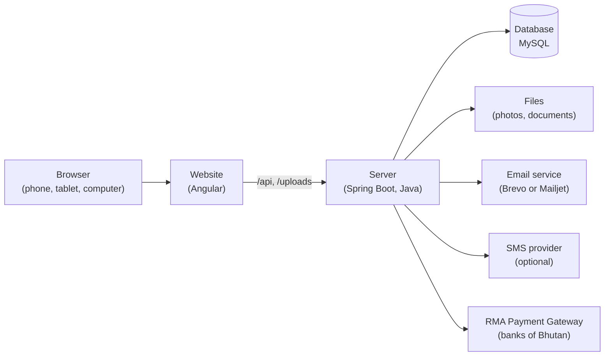
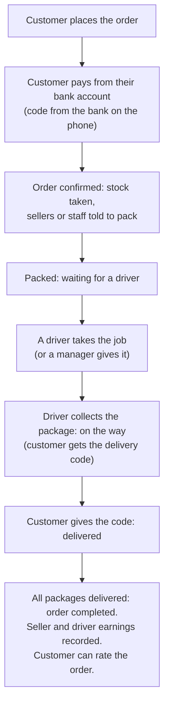

# 1. System overview

*In simple language, for everyone: the owner, staff, sellers, drivers and new developers.*

## 1.1 What DP DrukBazaars is

DP DrukBazaars is an online shop and marketplace for Bhutan, run from one system:

- **Customers** buy online, pay from their own bank account, follow their order and rate it.
- **Local sellers** sell their own products on the website. DP DrukBazaars takes the payment and delivers.
- **Delivery drivers** take delivery jobs and get paid for each delivery.
- **Staff** sell at the shop counter, keep the stock, pack and send orders, and check payments.
- **The owner (admin)** decides who may do what, approves sellers and drivers, sets fees and commission, and pays partners.

Everything happens in a web browser, on a computer, tablet or phone. Nothing has to be installed.

## 1.2 Who uses it

| Who | What they do | Where |
|---|---|---|
| Visitor | Looks at products, reviews, the About page, contacts the shop | The website, no account needed |
| Customer | Orders, pays, follows the order, rates it, changes their password | The website, with an account |
| Seller | Lists products, packs paid orders, sees earnings and payouts | **My shop** |
| Delivery driver | Takes jobs, collects packages, delivers them with the customer's code, sees earnings | **My deliveries** |
| Cashier / Controller | Sells at the counter, packs and sends orders, restocks | The staff bar under the top menu |
| Manager | Everything a cashier does, plus checking payments, discounts, returns, customers, reviews, reports | The staff bar |
| Admin (owner) | Everything, plus people and permissions, the marketplace, payouts, the website pages | The staff bar |

What each person sees depends on their **role** and the **permissions** the admin gives that role
(see the [Admin guide](04-admin-guide.md#2-roles-and-permissions)). The server checks every action again, so hiding a
button is never the only protection.

## 1.3 The parts of the system

| Part | What it does |
|---|---|
| **Website** | The pages people see. It asks the server for everything and shows the answers. |
| **Server** | The brain. It checks who is asking, decides what is allowed, works out prices and totals, and saves everything. |
| **Database** | Keeps all the records: people, products, stock, orders, payments, deliveries, reviews. |
| **Files** | Product photos, team photos, and sellers' and drivers' documents (documents are private: only admins open them). |
| **Email** | Sends password reset codes, order updates and notices. Needs an email service account (see the Admin guide). |
| **SMS** | Optional. Sends the delivery code and reset codes by text message. Needs a paid SMS account. |
| **RMA Payment Gateway** | Moves the money from the customer's bank account to the shop. Until the shop is registered with RMA, payments run in **test mode**: no real money moves and the pages say so. |

## 1.4 What it can do

**For customers**
- Browse and search products, see stars and reviews from real buyers, see who sells each product.
- A cart, a delivery fee worked out from the size of the products and the distance, and checkout.
- Pay from a bank account with a one-time code sent by the bank to the customer's phone.
- Follow the order step by step, see the driver, get the delivery code, download or print the receipt.
- Rate each product, the service and the delivery.
- Notifications (the bell at the top), forgotten password by email or text message, change password.

**For sellers and drivers**
- Apply online with documents and an agreement; the admin approves.
- Sellers: own products, packing, earnings and payouts.
- Drivers: a job board showing only jobs their vehicle can carry, delivering with the customer's code, earnings and payouts.

**For staff**
- **Counter (point of sale)**: fast selling with search or barcode, discounts, cash/bank transfer/card, receipts and
  A4 invoices, held sales, cash drawers with a count at the end of the shift, returns and credit notes.
- **Order board**: every online order from payment to the customer's door, who has it, what is late, drivers and routes.
- **Payments**: bank payments that need a decision, and older bank transfers to check.
- **Products and stock**: products with photos, restocking in batches with expiry dates, write-offs and counts.
  The oldest-expiring stock is sold first and expired stock is never sold.
- **Customers, messages, reviews**, and a **sales dashboard** with tax, discounts and real profit.

**For the admin**
- People and roles with tick-box permissions, temporary passwords, an activity log.
- The marketplace: applications, commission, delivery prices, payouts, agreements.
- The website: the About page (its texts and the team, with photos) and the shop's contact details and links
  (phone numbers, email, address, Facebook, Instagram, YouTube, TikTok), shown everywhere and on receipts.

## 1.5 How an online order travels

1. **Order.** The customer fills the cart and the delivery details. The server checks the stock and the prices,
   and splits the order into **packages**, one for each seller (DP DrukBazaars' own products are one package).
   Each package gets a delivery fee and a 4-digit **delivery code**.
2. **Payment.** The customer chooses their bank, types their account number and the one-time code their bank
   sends them. When the bank confirms, the order is paid and confirmed at once.
3. **Packing.** The seller (or our staff, for our own products) packs and marks the package **Packed**.
4. **Driver.** Drivers whose vehicle fits see the job and take it, or a manager gives it to a driver.
5. **Delivery.** The driver collects the package. The customer is told it is on the way and gets the delivery code.
   At the door the customer gives the code; the driver types it and the package is **Delivered**.
6. **After delivery.** When every package of the order is delivered, the order is **completed**. The seller's
   earnings (sale minus commission) and the driver's pay are recorded. The admin pays them out later.

If anything takes too long (payment not checked, not packed, not collected, not delivered), the order board marks it
**late** so staff can act.

**Pick up myself.** At checkout the customer can choose **Pick up myself** instead of **Deliver to my door**. There is
no delivery fee and no driver. Each package waits where it is packed: our shop for our own products, the seller's
pickup point for a seller's products. When a package is packed, the customer is told it is ready, with the address and
a 4-digit **collection code**. The customer comes, shows the code, and the seller (or our staff) taps **Handed over**.
The seller's earnings are recorded as for a delivery.

## 1.6 How a counter sale works

1. The cashier opens their **cash drawer** with the starting cash (the float).
2. They add products (search, tap, or scan the barcode), give a discount if allowed, and type the customer's phone
   number if the customer wants (it links the sale to the customer's history).
3. The customer pays: cash (the system shows the change), bank transfer (the journal number from the customer's
   banking app is typed in), card or UPI.
4. A receipt or an A4 invoice is printed or saved as a PDF.
5. At the end of the shift the cashier counts the cash and closes the drawer. A difference needs a note.

## 1.7 How money works

- **Prices are always decided by the server**, never by the browser. The cart only shows them.
- **Delivery fee** = a base fee for the package's size + a price per km beyond the first km included, rounded up to
  the next Nu. 5. Sizes: small (any driver), medium (motorbike), large (car), bulky (pickup truck).
  The admin sets the fees. A package further than the maximum distance cannot be ordered.
- **Driver pay** = a share of the delivery fee (set by the admin).
- **Commission** = a percentage of the seller's sale, set by the admin (a default, and per seller if needed).
  Seller earnings = sale - commission. Changes only apply to new orders.
- **Payouts**: the admin pays sellers and drivers by bank transfer and records it with the journal number.
  Nobody can be paid more than they are owed.
- **Refunds** (returns of counter sales and online orders, taken by staff): the customer gets back exactly what they
  paid for that item, within 7 days of the sale. The delivery fee is not refunded (the delivery took place). For a
  seller's product, the seller's share of it is taken back from their earnings automatically.
- **Journal numbers** (the bank's reference of a transfer) are never accepted twice, so one transfer cannot pay two sales.

## 1.8 How stock works

- Every delivery of stock is a **batch** with its own cost, batch number, expiry date and supplier.
- Sales take from the batch that **expires first**. Expired stock is taken off sale every night and staff are told.
- Every Monday morning staff hear what expires within 30 days.
- Staff can write stock off (broken, lost) with a reason, or count a product and correct it.
- Each product can have a **low-stock warning level**. When stock goes down to it, the people who restock are told
  (the seller, for a seller's product), and the product appears under **Low stock**.
- Two tills, or a till and the website, can never sell the last item twice.
- **Profit** on our own products uses the real cost of the batch each item came from.

## 1.9 Safety and privacy, in simple words

- **Passwords** are stored scrambled; nobody can read them. A password change signs the account out everywhere else.
- **Signing in** keeps you signed in for up to 4 hours without activity.
- **Every action is checked on the server**: a customer can only see their own orders, a seller only their own
  packages, a driver only their own jobs, and staff only what their role allows.
- **Bank details**: the full bank account number and the bank's code are never stored. Only the last 4 digits are kept.
- **Sellers' and drivers' documents** (CID, licences) are private: only admins can open them.
- **Reset codes** are stored scrambled, work once, run out after 10 minutes and allow 5 tries.
- **Important actions** (role changes, payouts, approvals, edits to the website) are written to an activity log.
- **Agreements**: customers, sellers and drivers accept the Terms or their agreement; the system records who
  accepted which version and when. A new version must be accepted again.

## 1.10 Where it runs

The live system runs on free hosting (see [DEPLOY-RENDER.md](../DEPLOY-RENDER.md)):

- **Render** runs the server and the website.
- **Aiven** keeps the MySQL database. Photos and documents are kept in the database there, because Render's free
  disk is wiped on every restart.

What the free plans mean in practice:

- After 15 minutes without visitors the server sleeps; the next visitor waits 1 to 3 minutes while it wakes up.
- Render's free plan blocks the usual email ports, so email goes through Brevo or Mailjet on port 2525.

## 1.11 What is not finished yet

| Item | Status |
|---|---|
| Real bank payments | Built and tested against a pretend gateway. Needs the shop's registration with the RMA Payment Gateway (merchant id and keys). Until then payments run in test mode and the pages say "TEST MODE: no real money". |
| Email | Built. Needs an email service account on the server (Brevo or Mailjet). |
| Text messages (SMS) | Built. Needs a paid SMS account (a Bhutanese operator's bulk SMS, or Twilio). |
| Agreements | The Terms, Seller Agreement and Driver Agreement are templates. Have them checked by a legal adviser. |
