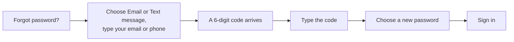
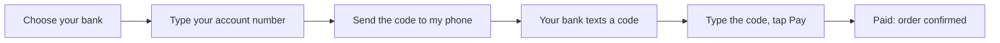
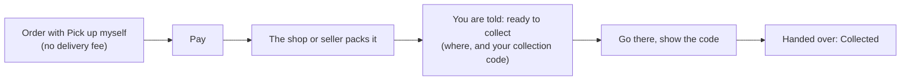
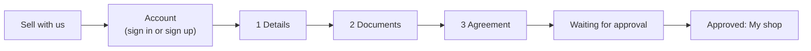
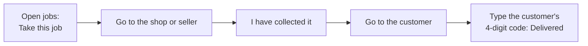

# 2. User guide: customers, sellers and delivery drivers

*Every step, in the order you do it. Words in **bold** are what you see on the screen.*

- [Part A: Customers](#part-a-customers)
- [Part B: Sellers](#part-b-sellers)
- [Part C: Delivery drivers](#part-c-delivery-drivers)

---

## Part A: Customers

### A1. Create an account

1. Tap **Sign in** (top right), then **Create an account**. You can also go straight to the **Sign up** page.
2. Fill in **Full name**, **Email**, **Phone number** (8 digits), **Password** (at least 6 characters) and
   **Confirm password**.
3. Read the Terms of Use and Privacy and tick **I agree to the ...**. This is required.
4. Tap the button to create the account. You are signed in.

One email and one phone number can have only one account.

### A2. Sign in and sign out

- **Sign in**: tap **Sign in**, type your email and password.
- You stay signed in for up to 4 hours without activity. After that, sign in again.
- **Sign out**: tap your initials (top right), then sign out.
- If you change your password, every other phone or computer where you were signed in is signed out.

### A3. Forgot your password

1. On the sign-in page tap **Forgot password?**
2. Choose where to get the code:
   - **Email**: type the email of your account. The email holds a 6-digit code and a link.
   - **Text message**: type the phone number of your account (8 digits). The code comes by SMS.
   A choice that shows **Not available yet** is not set up by the shop.
3. Tap **Email me a code** or **Text me a code**. If you do not get it, **Send a new code** appears after 60 seconds.
   Look in your spam folder too.
4. Type the code. It is checked as soon as the 6 digits are in. The code works for 10 minutes and 5 tries.
   (With email you can also simply open the link in the email.)
5. Type your new password twice and tap **Save new password**.
6. Tap **Sign in**: your email is already filled in.

If you cannot use your email or phone any more, call the shop or send a message from the **Contact** page. Staff
give you a temporary password; sign in with it and choose your own in **My profile**.

### A4. Find products

- **Products** (top menu): all products. Search by name or code, filter by category, sort.
- Each card shows the price (and the discount, if any), the stars from buyers, and whether it is in stock.
- Tap a product for its page: photo, description, price, stock, **Sold by** (DP DrukBazaars or a local seller),
  and **Customer reviews** from people who bought it.
- **Customer reviews** in the menu (or the footer) shows the shop's ratings for service, delivery and products.

### A5. Cart and checkout

1. Tap **Add to cart** on a product. The cart icon (top right) shows how many items you have.
2. Open the cart. Change quantities or remove items.
3. Under **How do you want to get it?** choose **Deliver to my door** (a driver brings it, with a delivery fee) or
   **Pick up myself** (free; you collect it, see A8). For pick up, the cart lists where each part of your order is
   collected, and no address is needed.
4. Fill in **Your details** (for delivery, also the location and the address):
   - your name and phone number (8 digits),
   - **Delivery location**: tap **Use my current location**, or choose your area from the list. This gives the
     exact delivery fee. Without it the distance is estimated.
   - the address (house, building, a landmark).
5. Check the **Order summary**: items, delivery fee (one per package; each seller sends their own package) or
   **Pick up myself: Free**, total.
6. Tap **Continue to payment**. You must be signed in; if you are not, sign in and you come back here.
7. On the payment page, **Pay with your bank account** is chosen. Tap **Place order and pay**.

The delivery fee depends on the size of the products (small, medium, large, bulky) and the distance. If the address
is too far away, the order cannot be delivered and a message says so; you can still choose **Pick up myself**.

### A6. Pay from your bank account

1. Choose your bank (Bank of Bhutan, Bhutan National Bank, Druk PNB, T Bank, BDBL or DK Bank).
2. Type your account number and tap **Send the code to my phone**. Your bank sends a one-time code to the phone
   number registered with that account.
3. Type the code and tap **Pay Nu. ...**. The money moves and your order is confirmed at once.
4. You see the result page with a link to your receipt.

Good to know:
- **Send the code again** works after 30 seconds. **Use another account** lets you start over with another account.
- 3 wrong codes end the attempt (nothing is taken). Start again from your order.
- If the bank does not answer in time, the page tells you that staff are checking with the bank. Do **not** pay
  again: you are told the result.
- DP DrukBazaars never stores your full account number or the code; only the last 4 digits are kept.
- While the shop is not yet connected to the RMA Payment Gateway, the page says **TEST MODE: no real money**.

### A7. Follow your order

- The **bell** (top right) shows notifications: paid, packed, driver on the way, delivered.
- **My orders** (menu or your initials) lists your orders. Tap one to open it.
- The order page shows:
  - the steps: **Placed**, **Confirmed**, **Shipped**, **Delivered** (for pick up: **Placed**, **Confirmed**,
    **Collected**);
  - each **package** (one per seller), its status and the driver;
  - your **Delivery code** (4 digits) while a package is on its way;
  - your delivery details, the items and the total;
  - **Receipt** once paid: view, **Download PDF** or print.

### A8. Receive your order

When the driver arrives, check the package and tell them your **Delivery code** from the order page (it is also sent
by SMS when text messages are on). The driver types it in; that proves the package reached you. Never give the code
before you have the package.

**If you chose Pick up myself**

1. When a package is packed you get a notification (and an SMS when text messages are on): **Ready to collect**.
2. Your order page shows, for each package, **Collect from** with the address, a **Call** button and a **Map** link,
   and your 4-digit **Collection code**. An order with products from several sellers is collected from each of them.
3. Go there, check your products, and show the code. The seller or our staff hand it over and the package shows
   **Collected**.

Never give the code to anyone before you have your products.

### A9. Cancel an order

You can cancel an order yourself while it is still waiting (not yet paid and confirmed): open it and tap
**Cancel order**. Once it is paid and being packed, contact the shop.

### A10. Rate your order

When your order (or a package of it) is delivered, the order page shows **Rate your order**:

1. Give each product 1 to 5 stars, add a comment if you like, tap **Post my rating**.
2. Under **How was our service?** give stars for the service and for the delivery, add a comment, tap
   **Send my feedback**.

Only your first name and the first letter of your last name are shown. You can **Change** your rating later. The shop
may answer your review in public.

### A11. Returns

Contact the shop (Contact page or phone). Staff can take items back within **7 days** of the sale. You get back
exactly what you paid for those items.

### A12. Contact the shop

**Contact** (top menu): fill in your name, email and message (write the order number in the message if it is about
an order). Staff answer by email. You can also call the number shown on the page and in the footer.

### A13. Your profile

**My profile** (your initials, top right): your details, your latest order, and **Change password** (type your
current password, then the new one twice).

### A14. Terms and privacy

The Terms of Use and Privacy are in the footer (**Terms & Privacy**). When a new version is published you are asked
to read and accept it.

### A15. Get the app

DP DrukBazaars can be installed as an app, straight from the website. It is free, needs no app store, and uses almost
no space. It is the same shop: the same account, cart, orders and notifications.

- **Android**: open the website in Chrome. Tap **Install** on the banner at the bottom (or menu **⋮ > Install app**).
- **iPhone and iPad**: open the website in Safari. Tap **Share**, then **Add to Home Screen**, then **Add**.
- **Computer**: in Chrome or Edge, click the install icon in the address bar.

**Get the app** in the menu (phones) and in the footer opens a page with these steps for your device
(`/app`; you can share that link).

Good to know:
- New versions arrive by themselves. The app switches to the new version when you open another page; if it says
  **A new version is ready**, tap **Update now**.
- The app opens fast because it keeps its pages on your phone. Ordering, paying and following orders need the
  internet. Without it, a page you have not opened before says **No internet connection**.
- To remove it, press and hold the icon and choose Remove or Uninstall.

---

## Part B: Sellers

Sellers sell their own products on DP DrukBazaars. Customers pay DP DrukBazaars; our drivers collect the packages
from you; you are paid your sales minus the commission.

### B1. Apply

1. Tap **Sell with us** (top menu, footer, or the About page). Sign in or create an account first.
2. **Details**: shop name, phone, town, pickup address (where drivers collect), a short description, CID number
   (11 digits), trade licence number and TPN (optional), and your bank details for payouts (bank, account name,
   account number).
3. **Documents**: a photo or PDF of your CID (required) and your trade licence (optional). JPG, PNG or PDF, up to 5 MB.
4. **Agreement**: read the Seller Agreement, tick that you agree and that the information is true and you are 18 or
   older, and send the application.
5. Wait. The admin checks the application and approves or refuses it (with a reason). You get a notification.

### B2. My shop

After approval, **My shop** appears in the staff bar. It has these tabs:

| Tab | What you do there |
|---|---|
| **Overview** | Packages waiting to be packed (and orders waiting for the customer to collect) and your earnings at a glance. Set your **Pickup point** in My shop so the delivery fee is exact. |
| **Packages** | Paid orders for your products. Pack each one and tap **Packed**. **Customer collects** lists packed orders the customer picks up from you. |
| **Products** | Add and edit your products: name, price, photo, stock, the delivery size, switch a product off. |
| **Money** | What you earned per delivered package, payouts received, and what you are still owed. |

### B3. Pack an order

1. You get a notification when a paid order has your products.
2. Open **Packages**, pack the items, tap **Packed**.
3. A driver comes to your pickup address. Hand the package only to the driver shown on the package.

You only see orders after they are paid. You never see other sellers' orders.

**When the customer picks it up themselves** (the package says **Customer collects**):

1. Pack it and tap **Packed, ready to collect**. The customer is told to come, with your pickup address.
2. When they come, ask for the 4-digit **collection code** on their order page. Tap **Customer collected it**, type
   the code, tap **Handed over**. A wrong code is refused: do not give the package.
3. Your earning is recorded at once, as for a delivery.

### B4. Get paid

- When a package is delivered (or collected by the customer), your earning is recorded: the sale minus the commission.
- The admin pays you by bank transfer and records it with the journal number. You see it in **Money**.

### B5. New agreement versions

When the admin publishes a new Seller Agreement, My shop asks you to read and accept it before you continue.

---

## Part C: Delivery drivers

Drivers take delivery jobs from the shop and from sellers to customers, and are paid for each delivery.

### C1. Apply

1. Tap **Deliver with us** (top menu, footer, or the About page). Sign in or create an account first.
2. **Details**: phone, town, vehicle type (on foot, bicycle, motorbike or scooter, car or taxi, pickup, van or truck),
   vehicle number, driving licence number and expiry date (for motor vehicles), CID number, an emergency contact
   (name and a different phone number), and your bank details for payouts.
3. **Documents**: your CID and your driving licence (JPG, PNG or PDF, up to 5 MB). On foot or by bicycle no licence
   is needed.
4. **Agreement**: read the Driver Agreement, tick that you agree and that the information is true and you are 18 or
   older, and send the application.
5. Wait for the admin's decision. You get a notification.

### C2. My deliveries

After approval, **My deliveries** appears in the staff bar:

| Tab | What you see |
|---|---|
| **Open jobs** | Jobs waiting for a driver that your vehicle can carry. The customer's exact address is shown only after you take the job. |
| **In progress** | Your jobs (at most 5 at a time): where to collect, where to deliver, the customer's phone. |
| **Money** | Your pay per delivery, payouts received, and what you are still owed. |

Which jobs you see depends on your vehicle: on foot or bicycle = small packages; motorbike or scooter = up to
medium; car or taxi = up to large; pickup, van or truck = everything, including bulky.

### C3. Deliver a package

1. In **Open jobs**, tap **Take this job**. Only one driver can take it.
2. Go to the pickup point (the shop or the seller), collect the package and tap **I have collected it**.
   The customer is told the package is on the way.
3. At the customer's door, hand over the package and ask for their delivery code. Type it in
   **Customer's 4-digit code** and tap **Delivered**.
4. Your pay is recorded at once.

If you cannot do a job, tap **Give back** (before collecting) so another driver can take it. A manager may also give
you a job directly; it appears in **In progress**.

### C4. Your licence

You are reminded 30 days before your licence expires. Once it has expired you cannot take new jobs until you
**Send renewed licence** from My deliveries.

### C5. Get paid

The admin pays you by bank transfer and records it with the journal number. You see it in **Money**.
