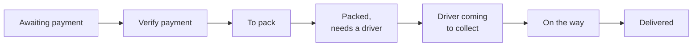

# 3. Staff guide

*For cashiers, packers and managers. Admin tasks (people, marketplace, website, settings) are in the
[Admin guide](04-admin-guide.md).*

## 3.1 The staff bar

When you sign in with a staff account, a green **Staff** bar appears under the top menu. It only shows what your role
may do. The groups are:

| Group | Pages | Permission needed |
|---|---|---|
| **Counter** | Point of sale, Sales history, Cash drawers | Use the point of sale |
| **Orders** | Orders (the order board), Verify payments | See orders / Verify payments |
| **Products** | Add product, Restock, Stock & expiry | Add and edit products / Restock |
| **Customers** | Customers, Customer messages, Reviews | See customers / Read customer messages / Manage reviews |
| **Reports** | Sales dashboard | See the sales dashboard |
| **Marketplace**, **People**, **Website** | Admin pages | See the Admin guide |

If a page you need is missing, ask the admin to give your role that permission.

The **bell** (top right) shows your notifications: payments to check, orders to pack, expiring stock, low ratings
and so on. Tap one to go to the right page.

## 3.2 The counter (point of sale)

### Open your cash drawer

1. Open **Counter > Point of sale**.
2. If your drawer is closed, type the starting cash (the float) and open it. Every sale you make is tied to your
   drawer and your name.

### Make a sale

1. Add products: type in the search box (name, code or category) or **scan the barcode**. **F2** jumps to the search.
   Tap a product to add it; change the quantity in the sale.
2. Discounts: the shop price is always allowed. A bigger discount needs the "Give extra discounts" permission and is
   never more than the product's maximum discount. You can also give a discount on the whole sale (percent or
   amount).
3. Customer (optional): type their phone number (8 digits). If they bought before, their name and history appear.
4. **Hold** puts a sale aside (up to 10) so you can serve someone else; recall it later. An unfinished sale survives
   a refresh or a crash.
5. Tap **Charge** (or **F9**) and choose how they pay:
   - **Cash**: type what they gave you; the change is shown. It must be at least the total.
   - **Bank transfer**: type the **journal number** from the customer's banking app (required, never accepted twice).
   - **Card** (approval code) or **UPI** (reference number): optional reference.
6. Complete the sale. Print the receipt (narrow printer), the **A4 invoice**, or save a **PDF**.

Products of marketplace sellers are not sold at the counter; they are sold online only.

### Close your cash drawer

1. At the end of your shift, close your drawer and count the cash in it.
2. The system shows what should be there: float + cash sales - cash refunds. If your count is different, write a note.
3. Print the end-of-shift report. It also lists the payments without cash (bank transfers, cards) to check against the
   bank statement.

Managers with "Manage all cash drawers" see every cashier's drawers in **Counter > Cash drawers**.

### Sales history and receipts

**Counter > Sales history** lists counter sales. Choose a period (today, this week, this month, or a custom range),
search by number, customer or journal number, open the receipt, or start a **Return**. Refunded sales show
"Refunded Nu. X" or "Fully returned". The total at the top shows net sales (sales minus refunds).

### Returns and refunds

Needs the "Take returns and refund" permission.

1. Find the sale in Sales history and tap **Return** (within **7 days** of the sale).
2. Choose the items and quantities coming back. You can return line by line, over several visits.
3. Mark damaged items as damaged: they do not go back into stock.
4. The refund is what the customer actually paid for those items (with their tax), never the list price.
5. Print the credit note (A4 or receipt).

## 3.3 Online orders: the order board

**Orders > Orders** shows every online order from payment to the customer's door.

From packing on, the board works per **package**: one package per seller (our own products are one package).

**At the top**
- The **pipeline**: how many orders are in each step. Tap a step to see only those.
- The **period**: Today, This week, This month (default), This year, or a custom range, by the day the order was
  placed. Orders placed earlier that are still open are never hidden: a banner counts them and **Show them** adds them.
- **Late** work comes first and a red banner counts it. Targets: check payment within 2 hours, pack within 4 hours
  of payment, collect within 2 hours of packing, deliver within 3 hours of collecting.

**Tabs**: **Needs action** (verify, pack, packed without a driver, anything late), **Mine** (what you are packing),
**Late**, **All in progress**, **Drivers** (every package a driver took in the period, with the route and pay),
**Done**. Search by order number, customer, phone, journal number, driver, packer, item or address.

**Each card** shows who has the order: who confirmed the payment, who is packing it and since when, which driver has
it (and whether a manager gave the job or the driver took it), and the route FROM the shop or seller TO the customer
with the distance. Tap a card for the side panel with the full history.

**Buttons, by step**

| Step | What you can do |
|---|---|
| Awaiting payment | Call the customer; **cancel** an unpaid order after a day |
| Verify payment | Check the payment (managers) |
| To pack | **Take it** (you pack it), **Packed**, **Give back**, **Give to...** another packer (managers), print the packing slip, mark a seller's package packed |
| Packed, needs a driver | **Give to a driver...** (only drivers whose vehicle fits the size), or **We deliver it** (our staff deliver, no driver pay) |
| Driver coming | **Collected**, **Change driver**, **Take off driver** |
| On the way | **Delivered** (staff do not need the customer's code) |
| Delivered | **Receipt** |

Taking and packing work needs "Pack, send and cancel orders"; giving work to others needs "Plan and assign orders".
The board refreshes itself every minute.

## 3.4 Checking payments

**Orders > Verify payments** needs the "Verify payments" permission (Admin and Manager by default; never the person
who packs).

- **Bank payments to check**: the bank never answered a payment (time-out or broken connection). Check with the
  bank, then choose **Money arrived** (type the bank's journal number; the order is confirmed) or **Nothing was taken**
  (the customer can pay again). Until you decide, the customer cannot pay twice.
- **Older bank transfers** (sent before payments went through the RMA Payment Gateway): compare the amount and the
  journal number with the bank statement, then confirm, **ask for more information**, or **reject** with a reason.
  The customer is told.

## 3.5 Products and stock

### Add or edit a product

**Products > Add product** (or **Edit** on a product page) needs "Add and edit products":
product name, description, category, cost price, selling price (or a markup %), MRP, opening stock, the low-stock
warning level, **Delivery size** (small, medium, large, bulky), barcode, supplier item code, and a photo
(JPG, PNG, WEBP or GIF, up to 5 MB).

### Restock (stock that arrived)

**Products > Restock** needs "Restock":

1. Find the product (or add a new one).
2. Type the quantity, the **cost of one**, and if known the **batch / lot number**, **expiry date** and supplier.
3. The page shows the margin at the new cost and warns you if a sale would lose money. You can set a **new selling
   price** (a suggested price keeps the old margin).
4. Save. The stock arrives as a new batch. An already expired batch is refused.

### Stock & expiry

**Products > Stock & expiry** has three tabs: **On the shelf**, **Expiring soon**, **Expired**. It shows the stock
value at cost. You can:

- correct a batch's number or expiry date,
- **write off** stock (broken, lost, expired) with a reason,
- **count** a product: more than expected adds a batch, fewer takes from the batch that expires first.

The system sells the batch that expires first, takes expired stock off sale every night, and tells you every
Monday what expires within 30 days.

## 3.6 Customers, messages and reviews

- **Customers** (See customers): search by name, phone or email; see how many orders and how much each customer
  spent, and their history. With "Edit customer details" you can correct details and keep staff notes.
- **Customer messages** (Read customer messages): messages from the Contact page. Answer by email from the message.
- **Reviews** (Manage reviews): tabs **Products**, **Service & delivery** and **Drivers** (average rating per driver,
  lowest first). Filters: All, Low (1-2 stars), Not answered, Hidden.
  - **Answer**: your answer is shown in public under the review and the customer is told.
  - **Hide**: only for abusive reviews or ones not about the product or service, never for honest low ratings.
  - A 1 or 2 star rating sends a notification to everyone who manages reviews.

## 3.7 Sales dashboard

**Reports > Sales dashboard** (See the sales dashboard) shows, for a period: total sales, orders, average order,
tax collected, discount given, returns, sold before tax, **what it cost us** (the real batch cost) and **profit on
our products**, and sales by channel (counter and online). Marketplace sellers' sales are not counted as our profit.

## 3.8 Good habits

- Sign out on shared computers.
- Never give your password to anyone; the admin can always reset it.
- Use **Give back** when you cannot finish a package, so it does not sit with your name on it.
- Check **Needs action** and the **Late** banner several times a day.
