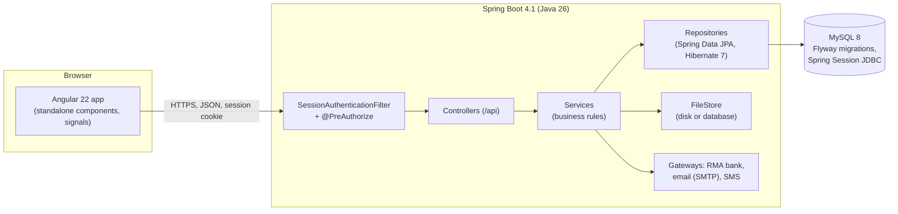

# 5. Technical reference

*For developers: how the system is built, how to run it, and the rules to keep.*

- [1. Architecture](#1-architecture)
- [2. Repositories and folders](#2-repositories-and-folders)
- [3. Running it on your computer](#3-running-it-on-your-computer)
- [4. Settings](#4-settings)
- [5. Server code](#5-server-code)
- [6. Website code](#6-website-code)
- [7. Security](#7-security)
- [8. Database](#8-database)
- [9. API](#9-api)
- [10. Business rules](#10-business-rules)
- [11. Scheduled jobs](#11-scheduled-jobs)
- [12. Tests](#12-tests)
- [13. Building and deploying](#13-building-and-deploying)
- [14. How we work](#14-how-we-work)

## 1. Architecture



| Part | Technology |
|---|---|
| Website | Angular 22 (standalone components, signals, `@if`/`@for`, zoneless), Bootstrap 4 CSS, Font Awesome, html2canvas + jsPDF (PDF receipts) |
| Server | Spring Boot 4.1.1, Java 26, Spring Security (method security), Spring Data JPA / Hibernate 7, Lombok, Spring Session JDBC, Spring Mail |
| Database | MySQL 8 (utf8mb4), Flyway migrations, `ddl-auto=validate` |
| Hosting | Render (Docker web service + static site), Aiven MySQL; or a Linux server with Nginx and systemd |
| Tests | JUnit 5, Spring Boot Test, MockMvc, H2 in memory (MySQL mode) |

The website and the server are served on **one address**: the website's host forwards `/api/*` and `/uploads/*` to
the server (Render rewrite rules, or Nginx). So the session cookie is first-party, and CORS is only needed when the
two have different addresses.

## 2. Repositories and folders

| | Server | Website |
|---|---|---|
| GitHub | `InventoryApi` | `InventoryWeb` |
| Folder | `D:\Inventory` (the Spring Boot project is `Inventory_System`) | `D:\Angular\inventory-project` |

```
D:\Inventory
├── Inventory_System\            the Spring Boot project
│   ├── src\main\java\com\api\inventory\   code (section 5)
│   ├── src\main\resources\
│   │   ├── application.properties, application-prod.properties
│   │   ├── db\migration\         Flyway: V1__... to V12__...
│   │   └── legal\                first versions of the agreements
│   ├── src\test\java\...         tests (section 12)
│   ├── secrets.properties        local database password (git-ignored)
│   ├── Dockerfile, pom.xml, PROJECT-NOTES.md
├── database\                     SQL scripts and backups (database\README.md)
├── deploy\                       own-server files (Nginx, systemd, env example)
├── docs\                         this documentation
├── DEPLOY.md, DEPLOY-RENDER.md

D:\Angular\inventory-project
├── src\app\
│   ├── Components\<page>\        one folder per page or part
│   ├── services\                 talking to the server
│   ├── guards\, interceptors\    sign-in and permission checks, session expiry
│   ├── utils\                    permissions.ts, staff-nav.ts, shop-info.ts, pdf.ts, ...
│   ├── models\, app.routes.ts
├── public\Images\                pictures (art\ = the drawn pictures)
├── scripts\draw-art.js           draws the SVG pictures
├── proxy.conf.json               development: /api and /uploads to localhost:8080
```

## 3. Running it on your computer

**You need**: JDK 26, Maven 3.9 (or IntelliJ IDEA), MySQL 8, Node 24 (`.node-version`).

**Server**

1. Create the database once: `CREATE DATABASE inventorydb CHARACTER SET utf8mb4;` (or `database\01-create-database-and-user.sql`).
2. Create `Inventory_System\secrets.properties` (git-ignored) with your MySQL password:
   ```properties
   spring.datasource.password=YOUR_PASSWORD
   ```
   The user is `root` by default (`spring.datasource.username`).
3. Start it from `Inventory_System`: `mvn spring-boot:run` (or run `InventoryApplication` in IntelliJ). It listens on
   port 8080. Flyway creates or updates the tables on start.

On a developer's computer: bank payments are in **test mode** (code `123456`), emails and text messages are not sent
but written to the server log (including reset codes, so you can test), and files are kept in `uploads\` and
`private-uploads\`.

**Website**

1. `npm install` (once).
2. `npm start` (`ng serve`): opens on `http://localhost:4200`. `proxy.conf.json` forwards `/api` and `/uploads` to
   `http://127.0.0.1:8080`.

**First admin**: sign up on the website, then run `database\02-first-admin.sql` with your email.

## 4. Settings

`application.properties` holds the values for a developer's computer; `application-prod.properties` changes them for
the live site (profile `prod`, set by the Dockerfile). Any setting can be overridden by an environment variable
(`app.mail.enabled` → `APP_MAIL_ENABLED`).

| Setting | Default here | Meaning |
|---|---|---|
| `spring.datasource.url / username / password` | local `inventorydb`, root, from secrets.properties | The database |
| `server.port` | `${PORT:8080}` | |
| `server.servlet.session.timeout` | `${SESSION_TIMEOUT:4h}` | Idle sign-in time. Cookie `SESSION`, HttpOnly, SameSite=Lax; Secure in prod |
| `app.public-url` | `http://localhost:4200` | The website's address, for links in emails |
| `app.cors.allowed-origins` | localhost | Only needed when the website and the server have different addresses |
| `app.files.store` | `disk` | `disk` (folders) or `database` (table `stored_files`, for Render) |
| `app.private-upload-dir` | `private-uploads` | Sellers' and drivers' documents (disk mode) |
| `spring.servlet.multipart.max-file-size / max-request-size` | 6 MB / 25 MB | Upload limits (photos and documents are checked at 5 MB) |
| `app.mail.enabled`, `app.mail.from`, `spring.mail.*` | off | Email (SMTP). Off = written to the log |
| `app.mail.log-body` | true (false in prod) | Write unsent emails to the log |
| `app.sms.enabled`, `app.sms.provider` (`url`/`twilio`), `app.sms.url`, `app.sms.twilio.*`, `app.sms.country-code` | off, url, 975 | Text messages |
| `app.sms.log-text` | true (false in prod) | Write unsent texts to the log |
| `app.payments.bank.mode` | `test` (`off` in prod unless set) | `off`, `test` or `rma` |
| `app.payments.bank.test-on-live-site` | false | Allows test mode with the prod profile (demo only) |
| `app.payments.bank.banks` | BoB, BNB, DPNB, TBank, BDBL, DK | Bank list with RMA's bank ids |
| `app.payments.bank.rma.*` | | RMA address, merchant (beneficiary) id, private key, RMA public key (see DEPLOY.md) |
| `app.payments.sandbox.enabled` | false | The old one-click test payment page |
| `app.orders.target.*-minutes` | verify 120, pack 240, pickup 120, deliver 180, unpaid 1440 | When the order board marks work late |
| `app.returns.window-days` | 7 | Days after a sale during which returns are taken |
| `app.timezone` | Asia/Thimphu | For the scheduled jobs |

## 5. Server code

Package `com.api.inventory`:

| Folder | What is in it |
|---|---|
| `config` | Security (SecurityConfig, method security), CORS, static files, schema repair, start-up tasks |
| `controller` | The `/api` addresses (section 9). Thin: they check input and call a service |
| `dto` | Shapes of requests and answers (many services use Java `record`s instead) |
| `entity` | Database tables (JPA entities) |
| `exception` | GlobalExceptionHandler: every error has the same JSON shape `{status, error, message}`; faults are logged with a reference and never show program details |
| `repository` | Spring Data repositories |
| `security` | `SessionAuthenticationFilter` (who is calling, from the session, checked against the database on every request), `Permissions` (the catalog and defaults), `AccessControlService` (roles and their permissions), `CurrentUser`, `OrderAccess` (owner checks) |
| `service` | The business rules. Key ones: `OrderService(Impl)`, `PackageService`, `AccountDetailsService`, `OrderBoardService`, `StockService` (the only place stock moves), `DeliveryPricingService`, `MarketplaceService`, `OnlinePaymentService`, `BankPaymentService`, `ReceiptService`, `JournalNumbers`, `NotificationService`, `EmailService`, `SmsService`, `PasswordResetService`, `ReviewService`, `SiteService`, `LegalTermsService`, `CustomerService`, `PosShiftService`, `SalesReturnService`, `AuditService` |
| `service/payments` | `BankGatewayClient` with `TestBankGatewayClient` and `RmaBankGatewayClient` (signed messages to the RMA Payment Gateway), `PaymentGateway` (older online-payment interface) |
| `service/files` | `FileStore` with `DiskFileStore` and `DatabaseFileStore` |

## 6. Website code

- **Pages** (`src/app/Components/<name>`): every page except Home loads lazily (`app.routes.ts`).
- **Guards**: `authGuard` (signed in) and `permissionGuard('...')` (has the permission). The server checks again.
- **Interceptors**: `session-expired` signs the browser out when the server answers 401.
- **Permissions**: the server sends the signed-in person's permissions; `AuthService.can()` uses them.
  `utils/permissions.ts` lists them with labels; `utils/staff-nav.ts` builds the staff bar from them.
- **Shop details** (phone numbers, email, address, links): managed by staff, loaded once by `services/shop-details.ts`
  (`ShopDetails`: `shop.phone`, `shop.links()`, ...), which falls back to `utils/shop-info.ts` until the server answers.
- **Styles**: design tokens in `src/theme.css` (`--green`, `--saffron`, `--ink`, ...). Do not reuse Bootstrap class
  names (`row`, `card`, `toast`, ...) for your own styles.
- **The app is zoneless**: change a signal, not a plain field, when the screen must update after a server answer.

Main routes:

| Address | Page | Who |
|---|---|---|
| `/`, `/products`, `/products/:id`, `/about`, `/services`, `/reviews`, `/contact`, `/terms`, `/terms/:type` | Public pages | Everyone |
| `/login`, `/signup`, `/forgot-password`, `/reset-password` | Accounts | Everyone |
| `/sell`, `/deliver` | Apply as seller or driver | Everyone (sign in to apply) |
| `/cart` | Cart and checkout | Everyone (sign in to pay) |
| `/payment`, `/pay/bank`, `/payment/result`, `/order-success` | Paying | Signed in |
| `/orders`, `/orders/:id`, `/receipt/:orderId`, `/profile` | My orders, receipt, profile | Signed in |
| `/pos`, `/pos-history` | Counter | pos.use |
| `/admin/orders`, `/order-verification` | Order board, payments | orders.view / payments.verify |
| `/products/new`, `/products/edit/:id`, `/restock`, `/admin/stock` | Products and stock | items.manage / stock.restock |
| `/admin/customers`, `/admin/messages`, `/admin/reviews`, `/admin/dashboard` | Customers, messages, reviews, reports | customers.view / messages.view / reviews.manage / reports.view |
| `/seller`, `/rider` | My shop, My deliveries | seller.portal / rider.portal |
| `/admin/marketplace`, `/admin/users`, `/admin/about` | Admin | marketplace.manage / users.manage / site.manage |

## 7. Security

- **Sign-in**: `POST /api/auth/login` creates a new session (the old id is dropped). Sessions live in MySQL
  (Spring Session JDBC), so a restart does not sign people out. The cookie is `SESSION`, HttpOnly, SameSite=Lax,
  Secure on the live site. CSRF tokens are off: the SameSite=Lax cookie is not sent with requests that another
  website starts, which is the protection relied on.
- **Every request**: `SessionAuthenticationFilter` reads the user from the database (so a role change or a switched-off
  account takes effect on the next click) and compares the password stamp (a password change signs out every other session).
- **Default deny**: every `/api` address needs a signed-in user unless `SecurityConfig` lists it as public.
  Public: sign-up/sign-in/me/logout, forgot and reset password, product list/product/stock, marketplace settings,
  delivery areas and quote, payment options, the payment gateway callback (signature checked), agreements, the contact
  form, public reviews, the About page, and `/uploads/{name}` (product and team photos only).
- **Permissions**: each action has `@PreAuthorize("hasAuthority('...')")`. Owner checks on top
  (`OrderAccess`, services): customers only see and cancel their own orders, sellers only their packages, drivers only
  their jobs.
- **Never trust the browser**: prices, totals, delivery fees, payment amounts and statuses are worked out on the server.
- **Secrets**: never in the code. Locally in `secrets.properties` (git-ignored); live in environment variables.
- **Personal and payment data**: full bank account numbers and bank codes are never stored or logged (last 4 only).
  Partner documents are private (`partners` area, admins only). Reset codes are BCrypt-hashed, links SHA-256-hashed.
- **Rate limits**: password reset (per account and per internet address), bank codes (per customer per hour),
  wrong-code limits for bank codes (3) and reset codes (5).
- **Audit**: `audit_log` records sensitive actions (roles, accounts, approvals, payouts, terms, website, cash drawers).

## 8. Database

Flyway builds the database from `src/main/resources/db/migration`. Hibernate only checks (`ddl-auto=validate`).

| Version | What it adds |
|---|---|
| V1 | The starting schema (all tables up to 2 Oct 2026) |
| V2 | Stock batches with cost and expiry (`stock_batches`, `order_item_batches`) |
| V3 | Sign-ins kept in the database (`SPRING_SESSION`, `SPRING_SESSION_ATTRIBUTES`) |
| V4 | Paying from a bank account (`bank_payments`, `payment_events`) |
| V5 | Journal numbers on counter sales and bank payments |
| V6 | Who handles each order (packer, who assigned the driver, staff courier, who confirmed the payment) |
| V7 | Files kept in the database (`stored_files`) |
| V8 | Reviews (`product_reviews`, `order_feedback`) |
| V9 | Forgot-password codes (`password_reset_codes`) |
| V10 | The About page (`site_texts`, `team_members`) |
| V11 | Low-stock warning level (`item_master.low_stock_threshold`) |
| V12 | Pick up myself (`orders.fulfilment` DELIVERY/PICKUP, `order_packages.self_pickup`, `order_packages.handed_over_by`) |

Tables by area:

| Area | Tables |
|---|---|
| People and access | `users`, `roles`, `role_permissions`, `audit_log`, `password_reset_tokens`, `password_reset_codes`, `SPRING_SESSION*` |
| Customers and messages | `customers`, `contact_messages`, `notifications` |
| Products and stock | `item_master`, `inventory_stock`, `stock_batches`, `transactions` (the stock ledger), `tax_details` |
| Orders and sales | `orders`, `order_items`, `order_item_batches`, `order_packages`, `shipments`, `pos_shifts`, `sales_returns`, `sales_return_items` |
| Payments | `payments` (older transfers), `payment_intents` (online attempts), `bank_payments`, `payment_events` |
| Marketplace | `seller_profiles`, `rider_profiles`, `partner_documents`, `marketplace_settings`, `delivery_areas`, `earnings_ledger` |
| Agreements | `legal_terms`, `terms_acceptances` |
| Reviews and website | `product_reviews`, `order_feedback`, `site_texts`, `team_members` |
| Files | `stored_files` |

Rules:

- **Never change a migration that has run** (V1 to V12): Flyway checks them on every start and the server refuses to
  start. A change is always a new file, `V13__what_it_does.sql`.
- Write migrations for MySQL 8 and check them on a scratch MySQL database before pushing (tests run on H2).
- Times are stored in UTC; entities use `Instant`. Money is `DECIMAL`.
- Data the app needs (roles, permissions, agreements, settings) is created by the app on start, not by hand.

## 9. API

All addresses start with `/api`. Answers are JSON. Errors: `{"status": 400, "error": "...", "message": "plain text for people"}`.
"Signed in" means any signed-in person; the service then checks ownership.

| Area | Addresses | Who |
|---|---|---|
| **Accounts** | `POST auth/signup`, `POST auth/login`, `GET auth/me`, `POST auth/logout` | Everyone |
| | `POST auth/change-password` | Signed in |
| | `GET/POST auth/forgot-password`, `POST auth/forgot-password/verify`, `GET auth/reset-password/check`, `POST auth/reset-password` | Everyone |
| **Products** | `GET items/allItems`, `GET items/{id}`, `GET items/stock/{itemId}` | Everyone (cost fields only for items.manage) |
| | `POST items/addItems`, `PUT items/{id}`, `DELETE items/{id}` | items.manage |
| | `GET items/search` | stock.restock or items.manage |
| **Stock** | `GET stock/summary`, `stock/batches`, `stock/items/{id}/batches` | stock.restock, items.manage or reports.view |
| | `GET stock/low` (products at or below their warning level) | stock.restock, items.manage or reports.view |
| | `PUT stock/batches/{id}`, `POST stock/batches/{id}/write-off`, `POST stock/items/{id}/count` | stock.restock |
| | `POST transactions/purchase` (restock) | stock.restock |
| **Orders (customers)** | `POST orders` | Signed in (own email) |
| | `GET orders/customer/{email}`, `GET orders/{id}`, `/items`, `/packages`, `GET orders/{id}/receipt`, `POST orders/{id}/cancel` | Signed in (owner, or staff) |
| **Orders (staff)** | `PUT orders/{id}/verify`, `POST orders/{id}/confirm` | payments.verify |
| | `POST orders/{id}/ship`, `/complete`, `GET orders/status/{status}` | orders.fulfil |
| | `GET admin/orders`, `POST admin/orders/{id}/confirm` | orders.view |
| | `POST admin/orders/{id}/cancel`, `/complete` | orders.fulfil |
| | `GET admin/order-board?from&to&older` | orders.view |
| | `POST admin/order-board/packages/{id}/take`, `/release`, `/packer` | orders.fulfil (giving to another packer: orders.assign) |
| | `POST admin/order-board/packages/{id}/rider`, `/rider/remove` | orders.assign |
| | `POST marketplace/packages/{id}/packed`, `/pickup`, `/deliver` | staff (orders.view / orders.fulfil) |
| | `POST admin/order-board/packages/{id}/handover` `{code}` (pick up; staff may send no code) | orders.fulfil |
| **Counter** | `POST orders/pos/sale`, `POST transactions/sale` | pos.use |
| | `GET pos/shifts/current`, `POST pos/shifts/open`, `POST pos/shifts/{id}/close`, `GET pos/shifts`, `GET pos/shifts/{id}`, `GET pos/history` | pos.use (all drawers: pos.shifts.manage) |
| | `GET customers/lookup?phone=` | pos.use or customers.view |
| **Returns** | `GET orders/{id}/returnable`, `GET orders/{id}/returns` | sales.return, pos.use or orders.view |
| | `POST orders/{id}/returns` | sales.return |
| | `GET returns/summary` | sales.return, pos.use, orders.view or reports.view |
| **Payments** | `GET online-payments/options` | Everyone |
| | `POST online-payments/start`, `GET online-payments/{ref}`, `POST online-payments/{ref}/cancel` | Signed in (owner) |
| | `GET online-payments/bank/banks`, `GET online-payments/bank/{ref}`, `POST .../{ref}/code`, `POST .../{ref}/pay` | Signed in (owner) |
| | `GET online-payments/bank/to-check`, `POST online-payments/bank/{ref}/settle` | payments.verify |
| | `POST online-payments/callback/{provider}` | The gateway (signature checked) |
| | `POST payments`, `GET payments/order/{id}`, `POST payments/{id}/confirm` | Older bank transfers (owner / payments.verify) |
| **Delivery** | `GET delivery/areas`, `POST delivery/quote` | Everyone |
| | `GET/POST/PUT/DELETE delivery/admin/areas[/{id}]` | marketplace.manage |
| **Marketplace** | `GET marketplace/settings` | Everyone |
| | `GET marketplace/my-applications`, `POST marketplace/apply/seller`, `POST marketplace/apply/rider` (multipart) | Signed in |
| | `marketplace/admin/...`: overview, settings, partners, seller/rider status, commission, balances, ledger, documents, adjustments, payouts | marketplace.manage |
| **Seller** | `GET seller/me`, `PUT seller/location` | seller.portal |
| | `GET seller/packages`, `POST seller/packages/{id}/packed`, `POST seller/packages/{id}/handover` `{code}` (own package, code required) | seller.orders |
| | `GET/POST/PUT seller/items` | seller.products |
| | `GET seller/ledger` | seller.earnings |
| **Driver** | `GET rider/me`, `POST rider/licence` | rider.portal |
| | `GET rider/jobs`, `GET rider/my-jobs`, `POST rider/jobs/{id}/accept`, `/release`, `/pickup`, `/deliver` | rider.jobs |
| | `GET rider/ledger` | rider.earnings |
| **Agreements** | `GET legal/terms/{type}`, `GET legal/terms/{type}/versions/{v}` | Everyone |
| | `GET legal/terms/{type}/status`, `POST legal/terms/{type}/accept` | Signed in |
| | `GET legal/admin/terms`, `POST legal/admin/terms/{type}` | marketplace.manage or users.manage |
| **Customers** | `GET customers`, `GET customers/{id}` | customers.view |
| | `PUT customers/{id}` | customers.manage |
| **Messages** | `POST contact` | Everyone |
| | `GET contact/all` | messages.view |
| **Notifications** | `GET notifications`, `GET notifications/unread-count`, `POST notifications/{id}/read`, `POST notifications/read-all` | Signed in (own) |
| **Reviews** | `GET reviews/products/{itemId}`, `GET reviews/summary`, `GET reviews/service` | Everyone |
| | `GET reviews/orders/{id}`, `POST reviews/orders/{id}/products/{itemId}`, `POST reviews/orders/{id}/service` | Signed in (owner, delivered only) |
| | `GET reviews/admin`, `POST reviews/admin/{products\|service}/{id}/hidden`, `/reply` | reviews.manage |
| **Reports** | `GET reports/sales`, `GET reports/sales/summary`, `GET admin/reports/sales-by-channel`, `GET stock/profit` | reports.view |
| **People** | `admin/permissions`, `admin/roles[/{id}]`, `admin/users[/{id}, /{id}/role, /active, /reset-password, /make-seller, /make-driver]` (`PUT admin/users/{id}` {name, email, phone}: edit details), `admin/audit` | users.manage |
| **Website** | `GET site/about`, `GET site/info` (contact details and links) | Everyone |
| | `PUT site/admin/info` | site.manage |
| | `GET/PUT site/admin/about`, `POST site/admin/team`, `PUT/DELETE site/admin/team/{id}`, `PUT site/admin/team/order` | site.manage |
| **Files** | `GET /uploads/{name}` (outside `/api`) | Everyone (product and team photos) |

The exact check of each address is the `@PreAuthorize` on its controller method; public addresses are listed in
`config/SecurityConfig.java`.

## 10. Business rules

**Order statuses**: `CREATED`/`PENDING` (waiting), `CONFIRMED` (paid), `SHIPPED` (a package collected), `COMPLETED`
(all packages delivered), `CANCELLED`. **Payment statuses**: `PENDING`, `PAID`, `PENDING_INFO`, `REJECTED`, `FAILED`.

**Package statuses**: `PENDING_PAYMENT` → `TO_PACK` → `READY_FOR_PICKUP` → `ASSIGNED` → `PICKED_UP` → `DELIVERED`
(or `CANCELLED`). One package per seller per order; our own products are one package.

**Bank payment statuses**: `STARTED` → `CODE_SENT` → `PAID`, or `FAILED`, `CANCELLED`, `EXPIRED`, or `CHECK_BANK`
(the bank never answered; staff settle it).

**Money**
- Money is `DECIMAL`, worked in whole cents; discounts use 8 decimals so totals match to the cent.
- Online prices come from `item_master`; the cart's prices are ignored. Counter prices must match the shop's MRP;
  discounts beyond the shop price need `pos.discount` and stay under the product's maximum discount.
- Commission = round(subtotal × rate / 100, 2 places, half up); seller earns subtotal - commission. Frozen on the
  package when the order is placed.
- Delivery fee = base(size) + max(0, road km - included km) × per-km(size), rounded **up** to the next Nu. 5.
  Road km = haversine distance × 1.35. Driver pay = driver share % of the fee (whole Nu.). The package size is its
  biggest product's size.
- A refund = what was paid for the item (unit price after discount × (1 + that sale's tax rate)), never above what
  was paid for the items; an online order's delivery fee is never refunded. A seller's share of returned items
  (subtotal - commission at the package's rate) is booked as a negative `RETURN` ledger entry, capped at what the
  package earned.
- Pick up myself: `OrderRequestDTO.fulfilment` = PICKUP needs no address; every package gets fee 0, rider pay 0,
  `self_pickup` = true. `markPacked` notifies the customer (READY_TO_COLLECT, with SMS) instead of drivers; such
  packages never reach `openJobs`, `accept`, `assignRider` or `pickUp`. `handOver` moves READY_FOR_PICKUP to
  DELIVERED (code = the delivery code; staff may skip it), records `handed_over_by` and books earnings like a
  delivery. Board stage COLLECT, target `app.orders.target.collect-minutes` (4320 = 3 days).
- Editing a person (`AccountDetailsService`): name 1-100, email unique (case-insensitive), phone 8 digits and
  unique. A new phone updates `customers.phone`; a new email updates the customer's own rows (orders,
  payment_intents, notifications, product_reviews, order_feedback, terms_acceptances, customers) and the email in
  pos_shifts, order_packages (packer, courier). Audit USER_DETAILS_CHANGED with old -> new; both addresses emailed.
  Not on yourself; an admin or users.manage holder only by an admin.
- Low stock: when a sale, write-off or count brings a product from above its `low_stock_threshold` to at or below
  it, `stock.restock` staff (or the seller) get one LOW_STOCK notification.
- Journal numbers: trimmed, upper case, 4 to 40 letters or digits, never accepted twice (checkout transfers and
  counter sales).

**Stock**
- `StockService` is the only place stock moves. Sales take the batch that expires first (FEFO; undated last, oldest
  first) and record which batches and their real cost. Returns go back to the same batches.
- Stock is taken atomically: the last unit cannot be sold twice.
- Expired batches are taken off sale every night; receiving an expired batch is refused.

**Duplicates**: each counter sale has a client reference (sending it twice returns the first sale); pressing Pay twice
returns the same payment attempt.

## 11. Scheduled jobs

| When | What |
|---|---|
| Every night 00:05 (Thimphu) | Expired batches taken off sale; staff with stock.restock told |
| Mondays 08:00 (Thimphu) | Staff told what expires within 30 days |
| Every 10 minutes | Old unfinished online payment attempts closed |
| Every night 03:30 | Notifications older than 90 days deleted |
| Every night 03:40 | Old password reset links, tickets and codes deleted |
| Every minute | Expired sign-ins removed (Spring Session) |

## 12. Tests

Run from `Inventory_System`: `mvn test`. They use H2 in memory (MySQL mode, Flyway off), never the real database;
emails and texts are caught by the tests.

| Test | What it proves |
|---|---|
| `MarketplaceFlowTest` | A full marketplace order with real numbers (commission, delivery, payouts, refusals), then returns of an online order (no delivery refund, the seller's share taken back) |
| `PosAndAccessTest` | Role rules, cash drawer numbers, discounts, duplicate sales |
| `SecurityHttpTest` | Real HTTP through the security chain; the sign-in cookie |
| `GoLiveFeaturesTest` | Forgot password by link, notifications, test payments, photo checks |
| `StockBatchTest` | FEFO, cost, expiry, counts, write-offs, profit |
| `LowStockTest` | The low-stock warning: once per crossing, sold out, the Low stock list |
| `BankPaymentTest` | Paying from a bank account: codes, limits, refusals, the bank never answering |
| `JournalAndReceiptTest` | Journal numbers and receipts |
| `RmaBankGatewayClientTest` | The RMA connector against a pretend gateway that checks signatures |
| `OrderBoardTest` | The order board, its steps and the period filter |
| `FilesInDatabaseTest` | Photos and documents kept in the database |
| `ReviewTest` | Only delivered products can be rated; moderation |
| `PasswordResetCodeTest` | Forgot password by code (email and SMS), limits, one-time tickets |
| `SiteAboutTest` | The About page and the contact details and links: who may change them, texts, team, photos, order, link checks |

49 tests, all passing (7 Oct 2026). The website: `npm run build` must pass with no errors.

## 13. Building and deploying

- **Server**: `Inventory_System/Dockerfile` builds with Maven (Temurin 26) and runs the jar as a non-root user with
  the `prod` profile, memory capped for a 512 MB machine and the Bhutan time zone. Render builds it on every push.
- **Website**: `npm run build` → `dist/inventory-project/browser`, published as a Render static site with the rewrites
  `/api/*` and `/uploads/*` → the server, and `/*` → `/index.html`.
- Step by step: [DEPLOY-RENDER.md](../DEPLOY-RENDER.md) (free hosting) and [DEPLOY.md](../DEPLOY.md) (own server).

## 14. How we work

- Small steps, each tested before the next. Money logic is tested with real numbers.
- Database changes only through new Flyway migrations, checked on a scratch MySQL database.
- The server decides; the browser only shows. Every new address gets a `@PreAuthorize` (or is listed as public on purpose).
- Plain language in screens, messages and comments.
- Update `PROJECT-NOTES.md` and these documents with every change.
